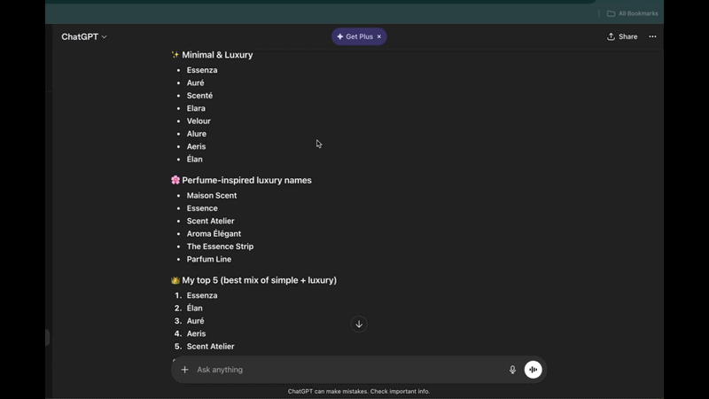

# ↩ AI Chat Reply



> WhatsApp-style reply buttons for ChatGPT, Claude and Gemini.

Hover over any message in an AI chat and click the **↩ Reply** button to quote it in your next message — just like WhatsApp. The AI will know exactly which message you're referring to.

---


## Supported Platforms

| Platform | URL | Status |
|----------|-----|--------|
| ChatGPT  | chatgpt.com | ✅ Supported |
| Claude   | claude.ai | ✅ Supported |
| Gemini   | gemini.google.com | ✅ Supported |

---

## How to Install (Developer Mode)

The extension isn't on the Chrome Web Store yet. Here's how to load it manually:

1. **Download this repo**
   - Click the green "Code" button above → "Download ZIP"
   - Unzip the folder somewhere on your computer

2. **Open Chrome Extensions**
   - Go to `chrome://extensions` in your browser
   - Turn on **Developer mode** (toggle in the top right)

3. **Load the extension**
   - Click **"Load unpacked"**
   - Select the unzipped `ai-reply-extension` folder

4. **You're done!**
   - Go to ChatGPT, Claude, or Gemini
   - Hover over any message — you'll see the ↩ Reply button 

---

## How to Use

1. Open any conversation on ChatGPT, Claude, or Gemini
2. Hover over the message you want to reply to
3. Click **↩ Reply**
4. A blue quote bar appears above the input box
5. Type your message and send — the quoted context is included automatically

To cancel a reply, click the **✕** on the quote bar.

---

## Adding a New Platform

Want to add support for another AI chat site? It's easy:

1. Open `platforms.js`
2. Add a new entry to the `PLATFORMS` object:

```js
"your-platform-name": {
  messageSelector: "CSS selector for message elements",
  inputSelector:   "CSS selector for the text input",
  sendSelector:    "CSS selector for the send button",
  getRole: (el) => "user" or "assistant",
  getText: (el) => el.innerText
}
```

3. Add the hostname to `detectPlatform()` at the bottom of the same file
4. Add the URL to `host_permissions` and `content_scripts` in `manifest.json`
5. Submit a pull request — contributions welcome!

---

## Project Structure

```
ai-reply-extension/
├── manifest.json   # Extension config — permissions, URLs, entry points
├── platforms.js    # CSS selectors for each AI platform
├── content.js      # Main logic — injected into chat pages
├── content.css     # Styles for reply button and quote bar
├── popup.html      # Settings panel (click extension icon)
├── popup.js        # Settings toggle logic
└── README.md       # You are here
```

---

## License

MIT — free to use, modify, and distribute.
